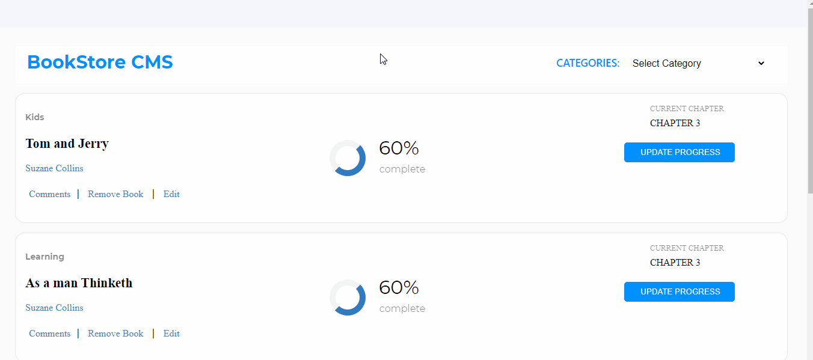

# The React Calculator

This calculator project is a web application responsive on desktop only, it is built using the React Library. You can do some basic math calculations such that include:
- addition & subtraction
- division & multiplication
- math with negative & positive values
- convert numbers to percentage values.

## Technologies used:
> technologies used in building this project include but are not limited to: 
- EcmaScript 6
- webpack
- big.js
- reactJS
- buildpack

## live Demo
[The Calculator](https://the-react-calculator.herokuapp.com/)

## Project Design

## Project SetUp
You can clone the project on your local machine by running:
- `git clone https://github.com/ClaytonSiby/The_Calculator.git`
then:
-  `cd The_Calculator`

### install all dependencies by running:
- `npm install`

- you can view the project live by runnig `yarn start`
- for production release/deployment run `npm run build` to bundle a minified version of the code.

## Author 

👤 **Clayton Siby**
​

- Github: [@ClaytonSiby](https://github.com/ClaytonSiby)
   
- Linkedin: [Linkedin Profile](https://www.linkedin.com/in/clayton-siby-48a8a0183/)

- Twitter: [@Twitter](https://twitter.com/ClaytonSiby)

## :handshake: Contributing 

* Contributions, issues and feature requests are welcome! Feel free to check the [issues page](https://github.com/ClaytonSiby/The_Calculator.git/issues)
- To contribute to this project:
- Fork this repository & clone locally.
- Create an upstream remote and sync your local copy.
- Create a new branch.
- Push your code to your origin repository.
- Create a new Pull Request .

## Show your support

Give a ⭐️ if you like this project!
